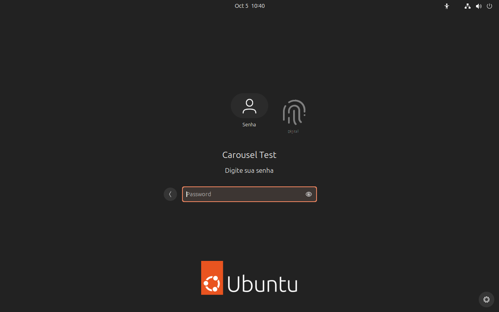
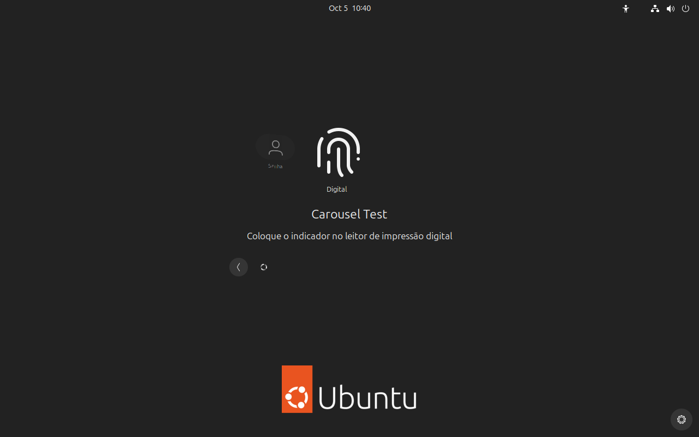
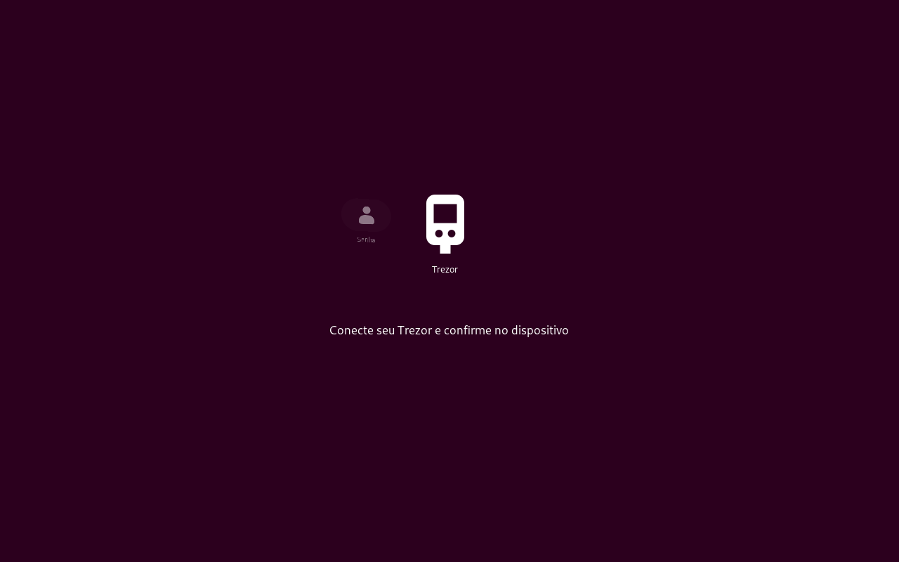

# GNOME Auth Carousel

Tela nativa de login e desbloqueio com **senha seguida de um segundo fator**,
escolhido na instalação: **impressão digital** (fprintd) ou **Trezor**
(FIDO2/U2F via `pam_u2f`). Carrossel de avatar/segundo fator e instruções na
língua do sistema. Mantém GNOME, GDM e PAM como autoridade de autenticação.

O avatar começa no centro e o segundo fator à direita. Depois da senha, o
carrossel gira em 250 ms e apresenta o digital ou o Trezor no centro. As instruções aparecem sem
espera proporcional ao tamanho de mensagens. Respeita animações desativadas.







## Compatibilidade inicial

| Componente | Suporte desta versão |
|---|---|
| Sistema | Ubuntu 24.04, arquitetura amd64 |
| Shell original | `46.0-0ubuntu6~24.04.14` exatamente |
| Shell instalado | `46.0-0ubuntu6~24.04.14+thinkpad2` |
| Login (`--factor fingerprint`) | GDM, conta local com senha e indicador cadastrado no fprintd |
| Login (`--factor trezor`) | GDM, conta local com senha e Trezor registrado com `pamu2fcfg` |
| Validação física | Digital: ThinkPad T15p Gen 3 / Synaptics Prometheus MIS / Wayland |
| Outros equipamentos | Piloto físico obrigatório; compatibilidade depende do leitor/driver/dispositivo |
| Idiomas | en (padrão), pt_BR, pt_PT, es, fr, de, it, nl, pl, ru, uk, tr, ja, zh_CN, ko; [adicionar outro](docs/translations.md) |
| Outros GNOME/distribuições | Precisam de adaptação e testes; o instalador recusa |

A instalação escolhe **um usuário local**. Outras contas conservam seu fluxo.
TTY, SSH, sudo e regras de energia não são alterados. A primeira versão
recusa instalações com `gnome-shell-extension-prefs` ou PAM personalizado além
dos modelos padrão Unix/SSSD auditados. Não remove esses componentes.

## Prévia sem instalar

```bash
python3 -m http.server 8768 --bind 127.0.0.1
```

Abra http://127.0.0.1:8768/prototype/. Os botões simulam etapas; a prévia não
recebe credenciais reais. `state.js` é a mesma máquina de apresentação nativa.
Escolha o segundo fator e o idioma na lateral; a prévia lê os mesmos `po/*.po`.

## Idioma

As instruções seguem o locale do processo: a tela de login usa o idioma do
sistema (`/etc/default/locale`), o desbloqueio usa o idioma da sessão. Sem
catálogo para o idioma, aparece o inglês. Traduções ficam em `po/` (domínio
gettext `gnome-auth-carousel`); veja [docs/translations.md](docs/translations.md).

## Instalação

1. Cadastre o segundo fator.
   - **Digital:** cadastre o **indicador esquerdo ou direito** em Configurações → Usuários.
   - **Trezor** (Safe 3/5, Model T ou One com FIDO/U2F ativo): conecte e desbloqueie
     o Trezor e rode, com a origem do computador (`HOST`, padrão: hostname em
     minúsculas):

     ```bash
     sudo apt install libpam-u2f
     sudo scripts/register_trezor.sh --user "$USER" --host HOST
     ```

     O `pamu2fcfg` 1.1.0 do Ubuntu 24.04 recusa a auto-atestação do Trezor
     (`fido_cred_verify (-7) FIDO_ERR_INVALID_ARGUMENT`); o script usa o
     `pamu2fcfg` 1.4.0 oficial compilado num container (Docker/Podman), grava
     `/etc/security/thinkpad-auth/u2f_keys` e prova uma autenticação real com o
     `pam_u2f` do sistema. Confirme no Trezor duas vezes. Reserva: `--append`.
     O PIN é digitado no próprio Trezor. Sem o Trezor conectado, o login local é
     negado: mantenha TTY/SSH para recuperação.
2. Confira `dpkg-query -W gnome-shell gnome-shell-common`: o par deve ser o
   original exato da tabela. Não faça downgrade geral para satisfazer o script.
3. Baixe esta versão do repositório e os artefatos da release:

```bash
gh repo clone vcanonici/gnome-auth-carousel
cd gnome-auth-carousel
git checkout v1.1.0
mkdir -p artifacts/packages artifacts/original-packages
gh release download v1.1.0 --repo vcanonici/gnome-auth-carousel --dir artifacts \
  --pattern 'gnome-auth-carousel-v1.1.0-amd64.tar.gz' --pattern 'SHA256SUMS'
(cd artifacts && sha256sum --check --ignore-missing SHA256SUMS)
tar -xzf artifacts/gnome-auth-carousel-v1.1.0-amd64.tar.gz -C artifacts/packages
```

4. Obtenha os **dois pacotes originais** para recuperação. No ambiente em que
   o APT ainda oferece essa versão, execute como usuário comum:

```bash
(cd artifacts/original-packages && apt-get download \
  'gnome-shell=46.0-0ubuntu6~24.04.14' \
  'gnome-shell-common=46.0-0ubuntu6~24.04.14')
```

Se o APT não oferece o par, use os arquivos do [build oficial Ubuntu](https://launchpad.net/ubuntu/+source/gnome-shell/46.0-0ubuntu6~24.04.14/+build/32789891):
`gnome-shell_46.0-0ubuntu6~24.04.14_amd64.deb` e
`gnome-shell-common_46.0-0ubuntu6~24.04.14_all.deb`. Confira seus SHA-256 com
`docs/original-packages.json` deste repositório antes de continuar.

5. Prepare (`--factor fingerprint` é o padrão; para Trezor use `--factor trezor`
   e a mesma `--host` do registro). Este comando verifica plataforma, segundo fator, usuário, pacotes e PAM;
   copia o backup root privado e **não encerra a sessão nem ativa a política**:

```bash
sudo python3 scripts/install.py prepare --user "$USER" --factor trezor --host HOST \
  --packages artifacts/packages \
  --manifest artifacts/packages/packages-manifest.json \
  --original-packages artifacts/original-packages
```

Anote o caminho `PREPARADO_SEM_ATIVAR`. Os comandos seguintes usam esse caminho
como `BACKUP`; substitua o exemplo pelo que o instalador mostrou.

6. **Salve seu trabalho.** O próximo comando reinicia o GDM e fecha aplicativos.
   Abre primeiro um console independente em Ctrl+Alt+F8 e arma uma reversão
   automática de dez minutos antes de instalar os pacotes e modificar o PAM:

```bash
BACKUP=/var/backups/thinkpad-auth/AAAA-MM-DDTHHMMSSZ-carousel
sudo python3 scripts/install.py start --backup "$BACKUP" --saved-work
```

7. Entre com senha, depois o segundo fator (digital ou confirmação no Trezor). Teste Super+L; senha sozinha deve manter
   bloqueio. Teste retorno de suspensão e cancelamento/repetição da tentativa.
   Se os testes passarem dentro da janela, confirme no terminal:

```bash
sudo python3 scripts/install.py confirm --backup "$BACKUP" \
  --login-ok --unlock-ok --resume-ok
```

Essas opções registram **testes físicos realizados por você**. Não execute
confirm antecipadamente. A confirmação desativa timer e console, preserva o
backup e deixa a política ativa. O complemento exige o par Shell/common exato:
para atualizar GNOME, restaure o original ou adapte e valide uma nova release.

## Recuperação

Se o fluxo falhar, **Ctrl+Alt+F8 → opção 1** restaura PAM e pacotes originais.
Também é possível usar TTY/SSH/sudo existentes:

```bash
sudo python3 scripts/install.py status --backup "$BACKUP"
sudo python3 scripts/install.py restore --backup "$BACKUP"
```

A reversão restaura primeiro os arquivos de autenticação e depois os pacotes,
sem reiniciar GDM automaticamente. Se estiver na tela de login travada,
entre no TTY e, após restaurar, use `sudo systemctl restart gdm3`; uma sessão
aberta exige salvar trabalho antes desse comando. O console de recuperação
não oferece shell geral e não pede senha/PIN. APT ocupado deve terminar
normalmente; o instalador recusa o início enquanto o gerenciador está ocupado.

## Compilar e testar com um comando

Requer apenas Docker ou Podman; nada é instalado no computador:

```bash
./scripts/container_build.sh
```

O script cria containers `ubuntu:24.04` descartáveis apontados para o
[snapshot assinado](https://snapshot.ubuntu.com) que ainda publica o Shell
`46.0-0ubuntu6~24.04.14`, roda testes unitários e de tradução, compila os
três pacotes e os artefatos da release em `artifacts/container/`. Depois, num
container limpo, executa o e2e: instala o Shell original, roda
`install.py prepare` e o piloto reais (fator Trezor), confere catálogos e
ícone instalados, exercita as pilhas PAM com `pamtester` (segundo fator
simulado só ali) e restaura tudo, comparando byte a byte. Opções:
`--build-only`, `--e2e-only`, `--upstream-tests`, `--help`.

## Compilação e testes

As releases incluem código-fonte correspondente completo do Shell modificado,
copyrights e licenças originais. [Instruções de build](docs/build.md).

```bash
npm test
python3 -m unittest discover -s tests -p 'test_*.py'
```

[Validação e limites](docs/validation.md). GPL-2.0-or-later para a integração;
componentes e empacotamento upstream conservam as licenças próprias.
